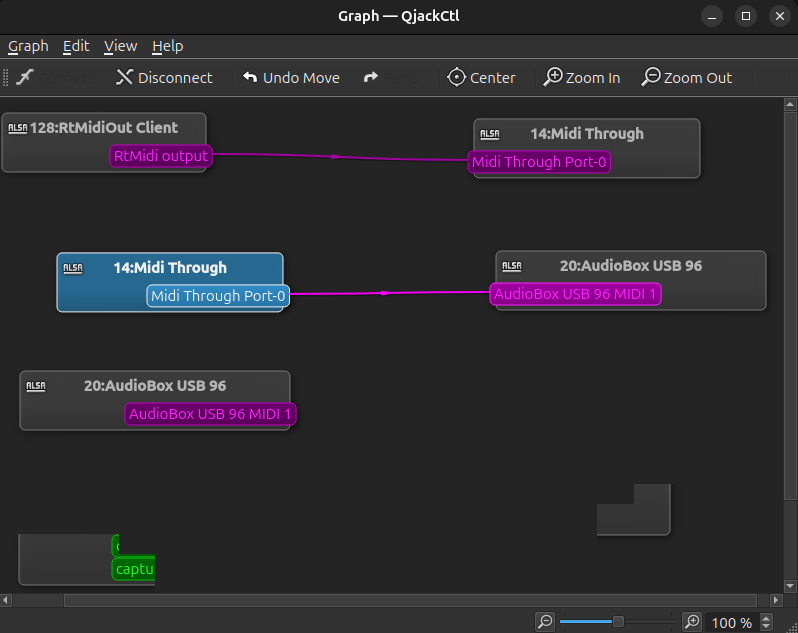

# Automating The Fender Tone Master Pro

The Fender Tone Master Pro (TMP) is a powerful effects processor, with many input/output (I/O) possibilities.

The TMP has MIDI I/O via 5-pin DIN cables. To interface with a computer, use a MIDI interface or an audio interface with MIDI DIN I/O.

The Presonus AudioBox 96 is one such audio interface. Connect the MIDI output on the AudioBox to the MIDI input on the TMP.

Then, using QJackCTL's graph view, route the output of ```MIDI Through``` to the ```AudioBox USB 96```. 

When running midification either through ```OSC_Message_Receiver.py``` or standalone, an instance of [RtMidi](https://caml.music.mcgill.ca/~gary/rtmidi/) will route to ```MIDI Through``` automatically. 


By routing the persistent ```MIDI Through``` device to the hardware, this connection will work so long as QJackCTL is open and the hardware is connected.

You should now be ready to send MIDI to the TMP via OSC. See the mapping table below for further details.

## Fender Tone Master MIDI CC Mapping

| MIDI CC# | VALUE | FUNCTION |
|----------|-------|----------|
| 0 | 0-3 | Bank Change |
| 1 | 0-127 | Expression Pedal 1 |
| 2 | 0-127 | Expression Pedal 2 |
| 3 | 0-127 | MIDI Expression Pedal 3 |
| 4 | 0-127 | MIDI Expression Pedal 4 |
| 7 | 0-127 | Master Volume |
| 20 | 0-63: OFF; 64-127: ON | FS Mode Enable |
| 21 | 0-63: OFF; 64-127: ON | Effects Footswitch 1 |
| 22 | 0-63: OFF; 64-127: ON | Effects Footswitch 2 |
| 23 | 0-63: OFF; 64-127: ON | Effects Footswitch 3 |
| 24 | 0-63: OFF; 64-127: ON | Effects Footswitch 4 |
| 26 | 0-63: OFF; 64-127: ON | Effects Footswitch 5 |
| 27 | 0-63: OFF; 64-127: ON | Effects Footswitch 6 |
| 28 | 0-63: OFF; 64-127: ON | Effects Footswitch 7 |
| 29 | 0-63: OFF; 64-127: ON | Effects Footswitch 8 |
| 30 | 0-7: Footsw 1-8 & 0-7: Favorites | Effects Footswitch 9 |
| 31 | 0-127 | Big Stomp |
| 64 | 0-63: OFF; 64-127: ON | Tap Switch |
| 65 | 0-63: OFF; 64-127: ON | Tone Switch |
| 66 | 0-63: OFF; 64-127: ON | Amp Control 1 (Typ) |
| 67 | 0-63: OFF; 64-127: ON | Amp Control 2 (Ring) |
| 68 | 0-63: OFF; 64-127: ON | Tuner |
| 69 | 64-127 | Next Song |
| 70 | 64-127 | Previous Song |
| 103 | 64-127 | Looper REC |
| 104 | 64-127 | Looper PLAY/STOP |
| 105 | 64-127 | Looper 1-SHOT |
| 106 | 64-127 | Looper UNDO |
| 107 | 64-127 | Looper 1/2 SPEED |
| 108 | 64-127 | Looper REVERSE |
| 109 | 64-127 | Looper VOLUME UP |
| 110 | 64-127 | Looper VOLUME DOWN |


[Source: Fender.com](https://www.fender.com/products/tone-master-pro)

[Internet Archive Mirror](https://web.archive.org/web/20250604015448/https://www.fmicassets.com/Damroot/Original/10032/OM_2274900000_Tone-Master-Pro_EN.pdf)