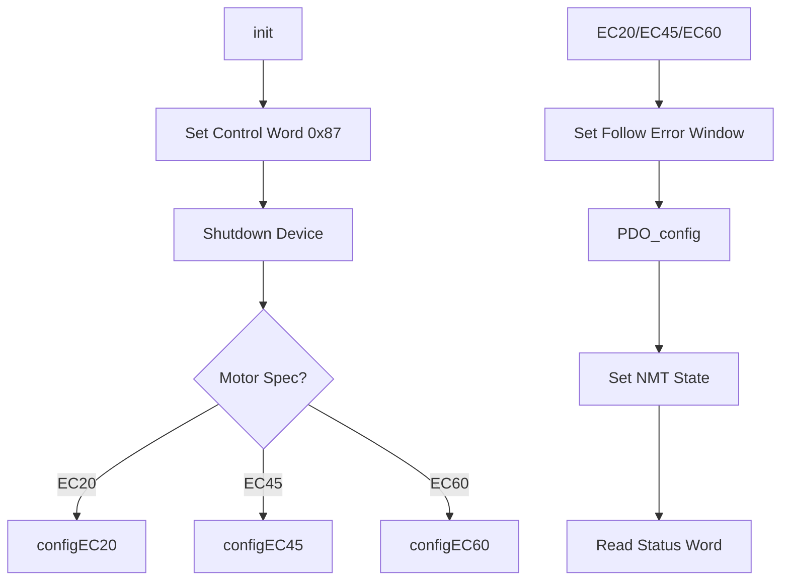

# Welcome to the deepest pits of GuitarBot!

If you're opening this for the first time, your curiosity has either led you to the wrong place or you need to enter a rabbit hole that is way beyond your paygrade.
Either way, this file exists to tell you all about the magic of EPOS4 and the three files (at the time of writing) that exist in this directory.
There's likely something you need to know that won't be covered here, in which case, please add it here if you find a solution. This stuff doesn't have much easily findable documentation and history tends to repeat itself.
I did NOT write 80 percent of the functions and definitions in these files, so you're getting second hand knowledge here from my own testing.

The files in this directory serve as the library to directly interact with the OpenCAN (Controller Area Network) messaging system for the EPOS4 boards.

- This means all of these functions are extremely important and knowing how they work is fundamental to implementing new functions efficently.
- Further documentation can be found here [EPOS4-Firmware-Specification-En.pdf](https://www.maxongroup.com/medias/sys_master/root/8834324856862/EPOS4-Firmware-Specification-En.pdf)
- The official documentation is pretty thick and some functions may not make sense at the first glance even with it in hand. Thus, making new functions or changing old ones for the first time might be challenging. Make sure to look things over with a fresh set of eyes and try not to get tunnel visioned on a specific function.
- It's also useful to have the Epos Studio in order to do initial startup and confirm the specs for your motors. To do so, simply connect the motor to the board, connect the board with USB to your computer, and power the board. Open Epos Studio, confirm that the node appears, and press the connect button at the top. Some useful tools you're gonna want to use are Startup Wizard, Object Dictionary, AutoTuning, and any positioning modes that fit your task. Below are some more detailed steps.
- Good Luck!
---

## Definitions:

- EPOS4: Refers to a modular, digital positioning controller by Maxon. They're the green boards behind the Guitar. The files in this directory interfaces with these boards directly.
- CANOpen: Conroller Area Network. The protocol for messaging between EPOS nodes. It uses wired connections (CAN Cables) to connect EPOS4 nodes to the Master, an OpenCR board in our case.
- SDO: Service Data Object, method for handling data from EPOS nodes with small delay (50ms). These are primarily used before `start()` is called in StrikerController, such as homing and enabling the motors.
- PDO: Process Data Object, method for handling data from EPOS nodes in real time (1-5ms). These are primarily used after `start()` is called in StrikerController, such as moving the motors using `PDOsetPosition()` or `PDOsetTorque()`. PDO has two categories- RPDO and TPDO.
- NOTE: In practice, PDO is up to 50 times faster than SDO despite the small time frames. This makes it suitable for real time control. SDO is generally much easier to use so I'd recommend playing with that first if you want to get hands-on quicker. While SDO and PDO can be used at the same time, a few SDO messages in a short time frame can overload CAN traffic and put the boards in a fault state.
- RPDO: Recieve Process Data Object, enables setting values to EPOS4 nodes in real time.
- TPDO: Transmit Process Data Object, enables reading values from EPOS4 nodes in real time.
- NOTE: RPDO and TPDO are independent of eachother. You can freely use one without the other.


---
## Motor Specs

- The first to anything involving this library is initialization. For successful initialization, it's important to know the name and type of motor you're working with. Please also take some time to familiarize yourself with the motor in Epos Studio if you haven't already.
- Each motor has its own set of data. Things like PID, nominal current, torque constant, etc. It's best to find the spec for the motor, provided by Maxon. For example, most motors at the time of writing are EC45 motors with encoders. The diagram for this motor looks like [this](https://www.maxongroup.com/medias/sys_master/root/8833813184542/19-EN-264.pdf)
- All of the necessary information that need to be included for each motor is in a set function during initialization. More detailed steps follow.
---

## EPOS4 Initialization Functions

### Core Initialization (`Epos4::init()`)

```cpp
int Epos4::init(int iNodeID, MotorSpec spec, bool inverted, unsigned long timeout_ms)
```

**Purpose**: Primary initialization routine for EPOS4 controllers.
**Parameters**:

- `iNodeID`: CANopen node ID (1-127)
- `spec`: `MotorSpec` enum (EC20/EC45/EC60 variants)
- `inverted`: Direction inversion flag
- `timeout_ms`: SDO operation timeout

**Key Operations**:

1. Sets CANopen NMT state to Pre-Operational
2. Configures motor specifics
3. Sets follow error window (safety threshold)
4. Configures PDO mappings (more on this after initialization step)
5. Reads initial status word for verification

**Flow**:




---

### Motor-Specific Configuration
There are many config functions to represent the sets of motors. However, we use most of the same specs since most are the same type. 
The two types of motors used at the time of writing are the EC20 non-encoder and EC45 encoder motors. 

#### EC45 Motor (`configEC45()`)

```cpp
int Epos4::configEC45()
```

**Spec Parameters**:

```cpp
setNominalCurrent(3210);        // 3.21A
setOutputCurrentLimit(5000);    // 5A limit
setMotorTorqueConstant(36900);  // 36.9 mNm/A
setThermalTimeConstantWinding(296); // 29.6s
setNumPolePairs(8);             // 8 pole pairs
setEncoderNumPulses(2048);      // 2048 CPR; not in the motor diagram. Tends to either be 2048 or 1024. Test in EPOS Studio with both values. 
```


#### EC20 Motor (`configEC20()`)

```cpp
int Epos4::configEC20()
```

**Key Differences**:

```cpp
setNominalCurrent(1310);        // 1.31A
setOutputCurrentLimit(1200);    // 1.2A limit
setMotorTorqueConstant(5880);   // 5.88 mNm/A
setNumPolePairs(4);             // 4 pole pairs
```
Make sure to check every spec parameter, a single wrong value can break many parts.

### PID
PID values control how aggresive the motors seek their target position, torque, or velocity based on the operation mode. 
There are several setCurrentControlParameters... and  setPositionControlParameters... functions that set the PID (proportional integral derivative) values for each motor group. Motor groups include the Sliders, Pressers, and Pickers.
Since PID values depend on the application of the motor, they cannot be provided by any documentation from Maxon. You must find these values for yourself. 
Luckily, you can use Epos Studio in order help find these values and enter them into the code, similar to the rest of the specs. 
In order to do so:
  - Connect your motor to EPOS studio using steps at the top of this file.
  - Once connected, make sure all of the other motor specs are entered using the Startup Wizard.
  - Click Regulation Tuning. You'll see three windows on the left side of the screen: Current, Velocity, and Position. The PID values are in the 'Show Parameters' dropdown menu. If you don't need to set up a new motor, you can stop here. Otherwise...
  - Before clicking autotune, make sure the motor can do a full rotation and the step amplitude is a small value that you know is safe and the setup is secure. The motor will begin to move once you press Auto tune.
  - If it successfully runs, check and take note of the PID values. Also confirm that the test movement has low following error using the graph. 
  - You're done with Current tuning. Unless you want to use velocity mode, skip to the Position tab.
  - The step amplitude is now in motor increments instead of a current. Again, make sure it's a low value and be prepared to turn off the motor just in case. You'll also need to check the test signal to make sure the positions are not beyond the bounds of the system.
  - Once you confirm, press auto tune and wait for it to complete. Confirm that there is low following error and take note of the PID values.
  - Here's an example [video](https://www.youtube.com/watch?v=-YdDvpdmDoQ) 

If your motor errors out during tuning, there are several potential causes. The most common causes that I saw are incorrect encoder resolution and encoder sensor setup. Both of these are set using the Startup Wizard. Pay attention to the error messages that appear in the main Epos Studio window for hints and make sure you're ready to turn off the motor for safety. 

Once you have your values, you can enter them into the code. Include the decimal values when you enter them. For example, 1020.304 gets entered in as 1020304. 
If setting up new motor groups, create new setters based on existing ones. If you're tuning an old motor, find the corresponding setters and enter in the new values.
You can tell which gain you're entering by looking at the name of the address within the setter. For example:
```cpp
n = writeObj(POS_CTRL_PARAM_ADDR, PC_P_GAIN, 9348336); 
```
Represents a P gain and 9348.336 is the current value. If I wanted to change the P gain to 1020.304 it would look like this:
```cpp
n = writeObj(POS_CTRL_PARAM_ADDR, PC_P_GAIN, 1020304); 
```


### Critical Functions

#### `setOpMode()`

```cpp
int Epos4::setOpMode(OpMode opMode, uint8_t uiInterpolationTime, ...)
```

**Modes**:

- `Homing`: Configures homing method/parameters
- `ProfilePosition`: Configures motion profiles
- `CyclicSyncTorque`: Sets motors to use torque values for movement given in % of motor rated torque; the EC20 motors use this 
- `CyclicSyncPosition`: Sets motors to use absolute or relative position values to move relaive to the home position; The EC45 motors use this
- `CyclicSyncVelocity`: Sets motors to use a velocity value for movement, unused
- NOTE: The EC20's switch between CSP and CST to unpress and press the string respetively.

### `writeObj(_WORD index, _BYTE subIndex, _DWORD param)`
This function is pretty much your one stop for all SDO communication. It writes a value (param) to some address (index) at some sub-index (subIndex). 
As a very simple example:

```cpp
int Epos4::setHomingCurrentThreshold(_WORD currentThreshold) {
    return writeObj(0x30B2, 0x0, currentThreshold);
}
```
here, writeObj writes the currentThreshold to address 30B2 at sub index 0. If you want to know what this changes, try searching for 30B2 in the [Firmware Spec](https://www.maxongroup.com/medias/sys_master/root/8833813184542/19-EN-264.pdf) 
Most of what you'll need from SDO is already handled, but if you're ever confused about any function that uses writeObj you can search the address and sub-index in the Firmware Spec to get many useful hints.
If you need to write a new SDO function, there are many examples to pull from in epos4.cpp! Make sure you're writing to the correct address, subindex, with the desired value (units such as int32, int16, matter). Just make sure your new function is defined in the header file too. 
striker.h can call these functions by doing something like:
```cpp
int setHCT(int threshold){
  return epos.setHomingCurrentThreshold(threshold);
}
```
by extension, StrikerController can call functions in striker to access specific motors:
```cpp
m_striker[1].setHCT(1000);
```
It's best practice to have an error handler should they occur during an SDO function like this:
```cpp
int Epos4::setHomingCurrentThreshold(_WORD currentThreshold){
    int err = writeObj(0x30B2, 0x0, currentThreshold);
    if (err != 0) {
        LOG_ERROR("Write Obj failed for setting Homing Current Threshold. Error code: ", m_uiError);
        return -1;
    }
}
```

### `readObj(_WORD index, _BYTE subIndex, _DWORD* answer)`

If you understand writeObj, readObj should feel intuitive. readObj is another SDO function that fetches data from the motor controllers so you can save it to a pointer. If you give some address (index) and a sub-index (subIndex) and a pointer (answer), you should be able to recieve the value at that address and subindex saved to the pointer. 


#### `PDO_config() and RPDO initialization`

PDO is the realtime control mechanism that we use to move GuitarBot. As stated in the definitions, it comes in the form of RPDO to set new positions/ torque values to the motor controllers and TPDO to read position values from the motor controllers. 

```cpp
int Epos4::PDO_config()
```
This funciton configures TPDO then RPDO during initialization for every motor controller. Let's start with RPDO first; we need to follow these steps:

1. Set COB-ID
2. Set Transmission type
3. Set RPDOmapping:
     a. Write the value “0” (zero) to subindex 0x00 (disable PDO).
     b. Modify the desired objects in subindex 0x01…0x0n.
     c. Write the desired number of mapped objects to subindex 0x00.

The COB-ID (communication object identifier) is just a unique address for RPDO to know where data is being accessible. In order to make sure they are unique for every node, we add the node-ID to the COB-ID which is set in the `epos.def` file. The transmission type determines when data is being written; a value of 1 (synchronous) means the data is written at specific intervals. A value of 255 (asynchronous) means data can be written regardless of time at the cost of some efficency. We then set the RPDO mapping so that we know which address to modify with our new data. For any given mapping, we write the first 4 bits which is the address of the data and the last four bits are based on the amount of data it takes.
```cpp
err = writeObj(0x1602, 0x02, 0x607A0020);
// Maps position to RPDO3. try searching 607A in the firmware spec. Since Position takes a 32int as the datatype, we use 0020 as the last 4 bits.
``` 
There is a limited amount of data we can map, but we have 4 RPDO's we can work with. In our case, we use RPDO-3 for Position and RPDO-4 for Torque. Not every address can be mapped; only addresses that are writeable as defined by the firmware spec.

### RPDO Usage:

The last component we need is a function to set the value. This function creates a new message with the RPDO COB-ID, packs the parameter data (position in this case) and then writes it to the Canbus. There are two other RPDO set functions to use as a template. 
```cpp
int Epos4::PDO_setPosition(int32_t position) // Uses PDO to set position
```
This function, similar to SDO functions, would be called in striker with `epos.PDO_setPosition` and by extension in `StrikerController.h` with `m_striker[id].rotate(position)`. If you combine this knowledge with the fact that `RPDOTimerIRQHandler()` in `StrikerController.h` executes every 5 ms and calls `rotate()` for every motor, you now know how we achieve a 5ms time frame of control for GuitarBot.

### TPDO initialization

If we need to read data from the motor controllers in real time we can use TPDO. TPDO follows very similar steps to RPDO in mapping, but there are a couple key differences for usage. Initialization is almost the exact same:


1. Set COB-ID
2. Set Transmission type
3. Set Inhibition Time
4. Set TPDOmapping:
     a. Write the value “0” (zero) to subindex 0x00 (disable PDO).
     b. Modify the desired objects in subindex 0x01…0x0n.
     c. Write the desired number of mapped objects to subindex 0x00.

The transmission time is currently set to asynchronous, which means data is only passed when it is updated. For example, if I'm looking at the current position of the motor the data will transmit an update when the motor moves. The inhibition time is only relevant when the transmission type is asynchronous, as it currently is. It defines a minimum time interval that data can update. For example, if a motor is in motion and the transmission time is 200, then an update will be transmitted every 200ms or 5 times a second. We set this so we don't overload the CAN bus; think about how many messages we'd be getting if there wasn't a transmission time with 20 motors. Other than that, the other information should feel intuitive if you understand RPDO. We also have 4 TPDO's to work with. 

### TPDO Usage

Now that it is mapped, we use the following function to process the messages:
```cpp
int Epos4::PDO_processMsg(can_message_t& msg) {
```
`StrikerController` is set up to listen for these messages, as this is where the Can Bus is initialized it's called here:

```cpp
static void canRxHandle(can_message_t* arg) {
```

TPDO is a little harder to use, as you have to know which data you're looking for and catch it within `canRxHandle` instead of just calling a single function like in RPDO. Here's some additional context for how it's currently used should you want to extend the application of TPDO:

One known issue is that strictly using position control for the pressers causes them to trigger a CAN passive state error frequently. Thus, we require a different control mode for the pressers: Torque Control. There is no mechanical stop that results in the strings being open/unpressed, which means setting torque in either direction will cause a muted or pressed string sound. This means we somehow need to manually stop the motor in the position where the string would sound open. However, we can't implicitly keep track of the position because we're not setting it through position control. We also can't use SDO to read the position, just a couple calls would cause the RPDO handler to timeout due to latency. Therefore, we use TPDO to update the values automatically while the motors are in motion. This way, we can save the updated position to a variable for each motor and fetch it at any time as an O(1) operation from `StrikerController`. 

Now that we know where the motor is at any during Torque mode, we need to stop the motor once it reaches the unpressed position. We can't just set the torque to 0, the momentum of the motor will cause the fingertip to touch and mute the string. Instead, we switch the mode from torque to position and then we set the target position to 0 (unpressed state) to keep the motor there once the motor crosses a certain threshold. We use RPDO to set both of these values.

It's important to check the values over time before using them. You can print them in `canRxHandle()` with `serial.println()`. Values like position tend to oscillate which can throw a wrench in your implementation. Again, TPDO and RPDO function independently of eachother but the above is an example of just one interaction that gives higher-level control. Hopefully, it inspires some other interaction that results in a new or interesting sound that humans either cannot do or haven't heard before. 

---


