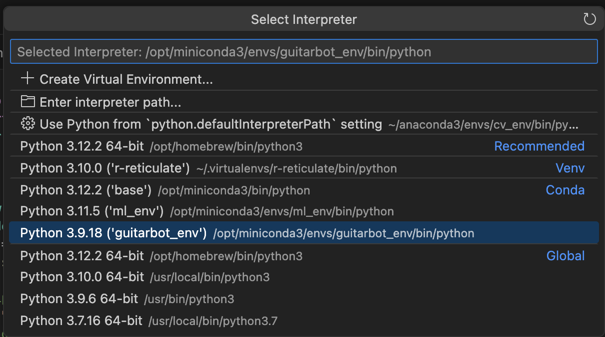
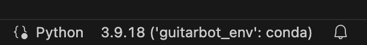

# GuitarBot
## Robotic Musicianship Lab at the Georgia Institute of Technology
### Advisor: Dr. Gil Weinberg
---
Project repo for GuitarBot.

**Contributors:** Amit Rogel, Marcus Parker, Jack Keller, Derrick Joyce, Ryan Baker

---

This details changes made from 2025-2026 for Ryan Baker's work on improving GuitarBot as a platform for data-driven analysis and performance. 
This branch also shared history with Marcus Parker's compositional work that explores GuitarBot's unique sonorities as a robotic musician.

**Goal: Enable the GuitarBot platform to have highly specified control messages to be used for audio-based calibration and learning**

This branch introduces a major refactoring of the parsing system to support dataset generation workflows for optimizing fretting force and dynamic range control.

### Major Changes

#### **New Modular Parser Architecture**
- **Replaced** monolithic parsing approach with modular left/right hand separation
- **Refactored** `DynamicsParser.py` → `RightHandParser.py` (enhanced with velocity mapping)
- **Cleaned** `LeftHandParser.py` to focus purely on fretting (removed right-hand concerns)  
- **Created** `BothHandsParser.py` as orchestrator for coordinated left/right hand trajectories

#### **Enhanced Message Protocols**
- **`/Fret` Messages**: MIDI note-based fretting with optional presser force control (0.0-1.0) (expanded to /RLFret for GuitaRL paper)
- **`/Dyn` Messages**: Right-hand dynamics testing with state-based or velocity-based plucking
- **Coordinated Messages**: Combined fretting + plucking for complete note production with a more overt code structure

#### **Dataset Generation Focus**
- **Fretting Optimization**: `/Fret` messages for calibrating optimal presser positions per fret
- **Dynamics Range**: `/Dyn` messages for testing plucking motor dynamic response
- **Clean Separation**: Robotics code separated from learning/dataset functionality
- **Recording**: Programmatically capture data from the robot for automated annotated corpus creation

## Environment Setup
**Prerequisites:** [Miniconda](https://conda.io/projects/conda/en/latest/user-guide/install/index.html) and the [midification](https://github.com/bakerbass/midification) repo cloned as a sibling directory (directory name remains `osc2midi`).

1. Clone this repository.
2. Clone `midification` into the same parent directory as GuitarBot (i.e. `../osc2midi` on disk).
3. From the GuitarBot directory, run:
   ```
   conda env create -f environment/environment.yml
   conda activate guitarbot_env
   ```
4. Note that if you're running the project from an IDE, you will need to select your new environment as the Python interpreter. See VSCode example below:



Run strikers.io in Arduino IDE by uploading to the OpenCR board, turning on the robot, and opening the serial monitor.

You're all set! Start sending messages using the **OSC_Message_Send.py** and **OSC_Message_Receiver.py** scripts to start the GuitarBot UI.

### New Parser
**GuitarBotParser.py** still handles pluck messages for longer form song trajectories.

**BothHandsParser.py** is designed for fine control of single-note events, i.e. for dataset generation and machine learning. 
 - **RightHandParser.py** and **LeftHandParser.py** are mostly just copied from **GuitarBotParser.py**


### To Update Environment Configuration:
1. Navigate to the **GuitarBot/environment** directory.
2. If not already activated, run `conda activate guitarbot_env` to activate the guitarbot environment.
3. Run `conda env export > environment.yml` to export the guitarbot environment to a new environment.yml file. Make sure to replace the existing environment.yml file.

---

### Message Protocol Updates

The new message types are reported in the terminal by running **OSC_Message_Receiver.py**

### Technical Improvements

#### **Trajectory Generation**
- **Consistent**: All parsers use `GuitarBotParser.interp_with_blend` for smooth motion
- **Robust**: Handle None returns from interpolation functions gracefully
- **Calibrated**: Use `tune.py` values for motor directions, positions, and conversions
- **Timed**: Explicit and easier-to-read coordination between left-hand prep and right-hand execution

#### **MIDI Integration** 
- **Unified**: All parsers use `STRING_MIDI_RANGES` for consistent note mapping
- **Flexible**: Support for full MIDI note range (40-68) across available strings
- **Validated**: Input validation for MIDI notes, velocities, and force parameters

#### **System Compatibility**
- **Format**: Maintains 15×N trajectory matrix (12 LH + 3 RH motors)
- **Integration**: Compatible with existing `RobotController` and OSC receiver
- **Plotting**: Clearer motor labels ([Function] No. vs. Motor No.)