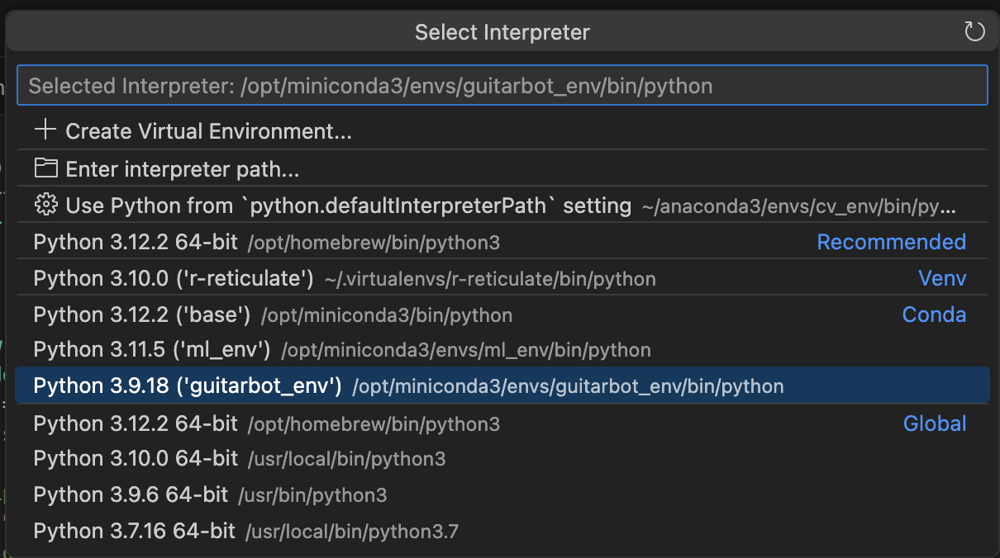

# GuitarBot
## Robotic Musicianship Lab at the Georgia Institute of Technology
### Advisor: Dr. Gil Weinberg
---
Project repo for GuitarBot.

**Contributors:** Amit Rogel, Marcus Parker, Jack Keller, **add contributors here**.

## Environment Setup
1. Clone this repository.
2. Install Python 3.9.18 [here](https://www.python.org/downloads/) (make sure to scroll down to the specific release version).
3. Install Conda [here](https://conda.io/projects/conda/en/latest/user-guide/install/index.html). While **Miniconda** is recommended, either of the Miniconda or Anaconda distributions are fine. Conda is a virtual environment and package manager for Python.
4. Once Conda is installed, open terminal in the cloned GuitarBot directory.
5. Run `conda env create -f environment/environment.yml` to create a new Conda environment for the project. It will automatically be named *guitarbot_env*.
6. To verify that the environment was installed correctly, run `conda env list`. You should see *guitarbot_env* as one of the options listed.
7. Run `conda activate guitarbot_env` to activate the new environment.
8. Note that if you're running the project from an IDE, you will need to select your new environment as the Python interpreter. See VSCode example below:

You're all set! Run the **UI/main.py** script to start the GuitarBot UI.

### To Update Environment Configuration:
1. Navigate to the **GuitarBot/environment** directory.
2. If not already activated, run `conda activate guitarbot_env` to activate the guitarbot environment.
3. Run `conda env export > environment.yml` to export the guitarbot environment to a new environment.yml file. Make sure to replace the existing environment.yml file.

## Documentation
See https://github.com/JackKeller27/GuitarBot/wiki.

Contains documentation on the project, along with to-do and existing bugs lists.

## Todo
- Scrollbar
- Drag & drop for song components
- "Legend" for how to input chords
- Saving custom strum pattern
- Strum patterns for different time signatures (how to handle a user trying to put a 3/4 strum pattern into a 4/4 bar?)
- 6/8? Custom time signatures?

Existing bugs:
- Section "Name" input box does not show up in 2/4 with only one bar
- Tab issue: details are documented in UIGen.py at the beginning of the "Section" class
